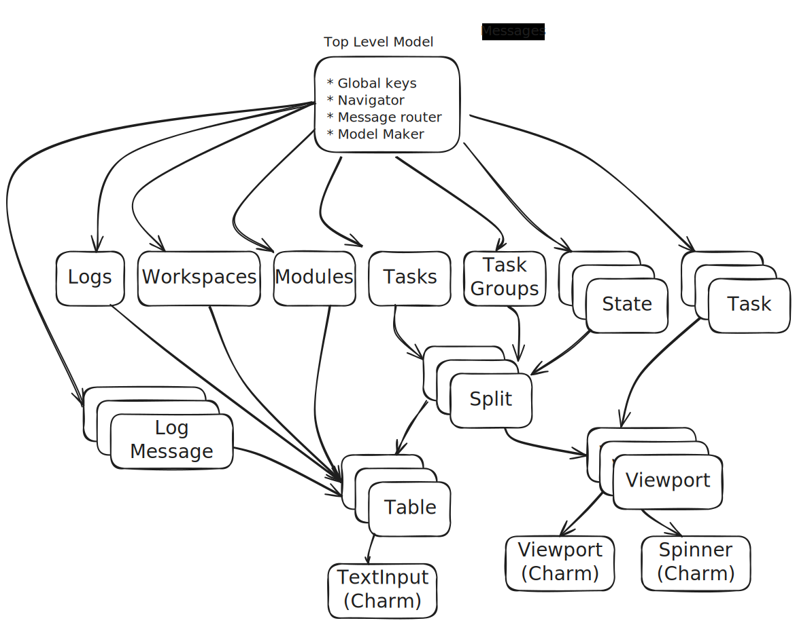

## 0. Intro

In the words of its authors [Bubble Tea](https://github.com/charmbracelet/bubbletea) is a "powerful little [TUI](https://en.wikipedia.org/wiki/Text-based_user_interface) framework" for Go. It may be little but I found it had a steep learning curve before I could get truly comfortable with its power. I spent many a late night wrangling with broken layouts and unresponsive keys before learning the hard way where I had gone wrong. The result of my efforts is [PUG](https://github.com/leg100/pug), a full screen terminal interface for driving terraform:


I announced PUG on reddit and in response to a user I [provided some pointers](https://www.reddit.com/r/golang/comments/1duart8/comment/lbhwwoj/) on using Bubble Tea.

This blog post is a fuller exposition of that advice; it is not a tutorial but a series of tips (and tricks) to assist anyone in the development, debugging, and testing of their TUI. Much of what follows is informed from various issues and discussions on the Bubble Tea github project, where both users and the authors have provided invaluable expertise and guidance.

## 1. Keep the event loop fast {#keepfast}

Bubble Tea processes messages in an event loop:

```go
func (p *Program) eventLoop(model Model, cmds chan Cmd) (Model, error) {
    for {
        select {
        case msg := <-p.msgs:
            // handle quit, window resize, etc
            // ...
            var cmd Cmd
            model, cmd = model.Update(msg) // run update
            cmds <- cmd                    // process command (if any)
            p.renderer.write(model.View()) // send view to renderer
        }
    }
}
```

A message is received from the channel and sent to the `Update()` method on your model. The returned command is sent to a channel, to be invoked in a go routine elsewhere. Your model's `View()` method is then invoked before repeating the loop and processing the next message.

Therefore Bubble Tea can only process messages as fast as as your `Update()` and `View()` methods. You want these methods to be fast otherwise your program may experience lag, resulting in an unresponsive UI. If your program generates a lot of messages they can back up and the program may appear to stall: a user presses a key and nothing happens for an indetermine amount of time.

The key to writing a fast model is to offload expensive operations to a `tea.Cmd`:

```go
func (m model) Update(msg tea.Msg) (tea.Model, tea.Cmd) {
	switch msg.(type) {
	case tea.KeyMsg:
            // don't do this:
            // time.Sleep(time.Minute)

            // do this:
            return func() tea.Msg {
                time.Sleep(time.Minute)
            }
	}
	return m, nil
}
```

## 2. Dump messages to a file

When debugging it can be invaluable to see the messages your model is receiving. To do so, dump every message to a file and tail that file in another terminal. I recommend [spew](https://github.com/davecgh/go-spew) to pretty print the messages. The following dumps messages when `DEBUG` is set:

```go
type model struct {
	dump io.Writer
}

func (m model) Init() tea.Cmd {
	return nil
}

func (m model) Update(msg tea.Msg) (tea.Model, tea.Cmd) {
	if m.dump != nil {
		spew.Fdump(m.dump, msg)
	}
	switch msg := msg.(type) {
	case tea.KeyMsg:
		switch msg.Type {
		case tea.KeyCtrlC:
			return m, tea.Quit
		}
	}
	return m, nil
}

func (m model) View() string { return "" }

func main() {
	var dump *os.File
	if _, ok := os.LookupEnv("DEBUG"); ok {
		var err error
		dump, err = os.OpenFile("messages.log", os.O_CREATE|os.O_TRUNC|os.O_WRONLY, 0o644)
		if err != nil {
			os.Exit(1)
		}
	}
	p := tea.NewProgram(model{dump: dump})

	if _, err := p.Run(); err != nil {
		fmt.Println("could not start program:", err)
		os.Exit(1)
	}
}
```

Run the program then, in another terminal, tail `messages.log`. Go back to the program and type `messages`, enter, and then quit the program with Ctrl-C, and you should see the other terminal spew out:

```
> tail -f messages.log 
(tea.WindowSizeMsg) {
 Width: (int) 127,
 Height: (int) 30
}
(tea.KeyMsg) m
(tea.KeyMsg) e
(tea.KeyMsg) s
(tea.KeyMsg) s
(tea.KeyMsg) a
(tea.KeyMsg) g
(tea.KeyMsg) e
(tea.KeyMsg) s
(tea.KeyMsg) enter
(tea.KeyMsg) ctrl+c
```

Note the first message received is the window resize message, which Bubble Tea sends to your program shortly after startup.

## 3. Live reload code changes

Web app developers use [livereload](https://github.com/livereload/livereload-js) to see the effects of code changes in near real-time in the browser. You should do the equivalent for your TUI. I've cobbled together a couple of scripts for PUG:

```bash
#!/usr/bin/env bash

# in foreground, continously run app
while true; do
    _build/pug -w ./demo/ -d -l debug
done
```

```bash
#!/usr/bin/env bash

# watch code changes, trigger re-build, and kill process 
while true; do
    go build -o _build/pug && pkill -f '_build/pug'
    inotifywait -e attrib $(find . -name '*.go') || exit
done
```

I run the scripts in separate terminals. Whenever I save code changes the changes are visible pretty much immediately afterwards thanks to Go's fast compilation. This solution could be improved to handle a couple of shortcomings:

* If I've messed up and PUG panics upon startup then it'll go into a death spin, restarting umpteen times a second until the error is fixed. A backoff mechanism would help here.
* Starting and stopping these scripts is a bit of a pain. To stop them, I first need to stop the rebuild script, then use `kill` to terminate the other script.

There are several tools out there like [air](https://github.com/air-verse/air) that do "live reload for the CLI". But [I found they didn't work](https://github.com/charmbracelet/bubbletea/issues/150) with programs that are expecting standard input to be a TTY, which includes TUIs, but users in that same issue [reported success with watchexec](https://github.com/charmbracelet/bubbletea/issues/150#issuecomment-988857894).

## 4. Use receiver methods on your model judiciously

In Go, a method receiver can be passed as either a value or a pointer. When in doubt, one typically uses a pointer receiver, with a value receiver reserved for [particular use cases](https://google.github.io/styleguide/go/decisions#receiver-type).

It can throw Go programmers then that the documented Bubble Tea models all have *value* receivers. It may be due to the fact Bubble Tea is based on the [Elm Architecture](https://guide.elm-lang.org/architecture/), which is a purely functional pattern, where functions cannot change their internal state, and in Go a method with a value receiver cannot modify its receiver.

However, you are free to set whatever receiver type you like. If you use a pointer receiver for your model and you make, say, a change to the model in `Init()` then that change is persisted:

```go
type model struct {
	content string
}

func (m *model) Init() tea.Cmd {
	m.content = "initialized\n"
	return nil
}

func (m *model) Update(msg tea.Msg) (tea.Model, tea.Cmd) {
	switch msg := msg.(type) {
	case tea.KeyMsg:
        switch msg.Type {
        case tea.KeyCtrlC:
			return m, tea.Quit
		}
	}
	return m, nil
}

func (m *model) View() string { return m.content }

func main() {
	p := tea.NewProgram(&model{content: "uninitalized"})
	if _, err := p.Run(); err != nil {
		fmt.Println("could not start program:", err)
		os.Exit(1)
	}
}
```

Returns:

```
initialized
```

However, bear in mind that Bubble Tea only renders changes in response to messages: 

```go
type model struct {
	content string
}

func (m *model) Init() tea.Cmd {
	go func() {
		<-time.After(time.Second)
		m.content = "initialized\n"
	}()
	return nil
}

func (m *model) Update(msg tea.Msg) (tea.Model, tea.Cmd) {
	switch msg := msg.(type) {
	case tea.KeyMsg:
		switch msg.Type {
		case tea.KeyCtrlC:
			return m, tea.Quit
		}
	}
	return m, nil
}

func (m *model) View() string { return m.content }

func main() {
	p := tea.NewProgram(&model{content: "uninitalized"})
	if _, err := p.Run(); err != nil {
		fmt.Println("could not start program:", err)
		os.Exit(1)
	}
}
```

Returns:

```
uninitialized
```

...but only once a key is pressed several seconds later does it return:

```
initialized
```

For this reason, making changes to the model is best done in the normal message flow, either in `Update()` or via a `tea.Cmd`. However, using a pointer receiver is useful on helper methods:

```go
func (m model) Update(msg tea.Msg) (tea.Model, tea.Cmd) {
	switch msg := msg.(type) {
	case tea.WindowSizeMsg:
		m.updateDimensions(msg.Width, msg.Height)
	}
	return m, nil
}

func (m *model) updateDimensions(width, height int) {
	m.width = width
	m.height = height
}
```

There is a [Github discussion](https://github.com/charmbracelet/bubbletea/discussions/434) on this subject, where there are different opinions on when to use pointer receivers.

## 5. Messages are not necessarily received in the order they are sent

In Go, if you have more than one go routine sending to a channel, the order in which the sends and receives occur is unspecified:

https://go.dev/play/p/G4-o8F6PsvU

```go
func main() {
	ch := make(chan int)
	wg := sync.WaitGroup{}

	for i := range 10 {
		wg.Add(1)
		go func() {
			ch <- i
			wg.Done()
		}()
	}

	go func() {
		wg.Wait()
		close(ch)
	}()

	for i := range ch {
		fmt.Printf("%d\n", i)
	}
}
````

Running the above can return something like this:

```
0512347689
```

Now, in Bubble Tea, messages arrive from a number of sources, including:

1) From user input, key presses, mouse movements, etc.
2) Messages from tea commands (`tea.Cmd`).
3) Explicitly sent using `Send(msg)`.
4) Signals such as window resize, suspend etc.

User input messages are sent in a single routine:

```go
// readAnsiInputs reads keypress and mouse inputs from a TTY and produces messages
// containing information about the key or mouse events accordingly.
func readAnsiInputs(ctx context.Context, msgs chan<- Msg, input io.Reader) error {
    // ...
    for {
        // Read and block.
        numBytes, err := input.Read(buf[:])
        // ...
        select {
        case msgs <- msg:
        // ...
```

User input messages *are* therefore sent in order. Just as well otherwise entering words into, say, a text input would end up as gibberish.

However, Bubble Tea commands are executed concurrently in separate go routines: 

```go
// handleCommands runs commands in a goroutine and sends the result to the
// program's message channel.
func (p *Program) handleCommands(cmds chan Cmd) chan struct{} {
    // ...
    case cmd := <-cmds:
        if cmd == nil {
            continue
        }
        // ...
        go func() {
            msg := cmd() // this can be long.
            p.Send(msg)
        }()
```

As such, the messages they produce are sent in an unspecified order. Even if a command finishes before another command there is no guarantee its message will be sent and received first.

The following demonstrates the point by explicitly sending messages using `Send(msg)` concurrently:

```go
type model struct {
	received []int
}

func (m model) Init() tea.Cmd {
	return nil
}

func (m model) Update(msg tea.Msg) (tea.Model, tea.Cmd) {
	switch msg := msg.(type) {
	case nMsg:
		m.received = append(m.received, int(msg))
	case tea.KeyMsg:
		return m, tea.Quit
	}
	return m, nil
}

func (m model) View() string {
	return fmt.Sprintf("%v", m.received)
}

type nMsg int

func main() {
	p := tea.NewProgram(model{})

	for i := range 10 {
		go p.Send(nMsg(i))
	}

	if _, err := p.Run(); err != nil {
		fmt.Println("could not start program:", err)
		os.Exit(1)
	}
}
```

Running the program produces:

```
> go run main.go
[0 1 9 8 5 6 4 2 3 7]
```

You cannot rely on the ordering of concurrently sent messages. If ordering matters you have a number of workarounds:

1. Update model directly within `Update()`:

    ```go
    func (m model) Update(msg tea.Msg) (tea.Model, tea.Cmd) {
        switch msg.(type) {
        case tea.KeyMsg:
            m.ordered = append(m.ordered, nextItem())
            // return func() tea.Msg {
            //   return nextItem()
            // }
        }
        return m, nil
    }
    ```

    This may contradict with [keeping Update fast]().

2. Use `tea.Sequence` to run commands in sequence, one at a time:

    ```go
    func (m model) Update(msg tea.Msg) (tea.Model, tea.Cmd) {
        switch msg.(type) {
        case tea.KeyMsg:
            return m, tea.Sequence(doThis, thenThat)
        }
        return m, nil
    }
    ```

    See the [docs](https://pkg.go.dev/github.com/charmbracelet/bubbletea#Sequence).

And finally, if ordering matters then try to refactor your program so that it doesn't. Embrace the chaos of concurrency.

## 6. Build a tree of models

Any non-trivial Bubble Tea program outgrows a single model. There's a good chance you're using Charm's [bubbles](https://github.com/charmbracelet/bubbles), which are models in their own right, each with a `Init()`, `Update()`, and `View()`. You embed these models within your own model. The same applies to your own code: you may want to push your own components into separate models. The original model then becomes the "top-level" model, whose role becomes merely a message router and screen compositor, responsible for routing messages to the correct "child" models, and populating a layout with content from the child models' `View()` methods.

And in turn the child models may embed models too, forming a tree of models: the root model receives all messages, which are relayed down the tree to the relevant child model, and the resulting model and command(s) are passed back up the tree, to be returned by the root model's `Update()` method. The same traversal then occurs with the rendering: the root model's `View()` method is called, which in turn calls child models' `View()` methods, and the resulting strings are passed back up the tree to be joined together and returned to the renderer.

This is the model tree implemented in PUG, with arrows illustrating the routing of messages from model to model:



The root model maintains a list or map of child models. Depending on your program, you may nominate a child model to be the "current" model, which is the one that is currently visible and the one the user interacts with. You might maintain a stack of previously visited models: when the user presses a key your program pushes another model onto the stack, and the top of the stack is then the current model. When the user presses a key to go "back" the model is "popped" off the stack and the previous model becomes the current model.

You can opt to create your child models up front upon program startup. Or you could create them dynamically upon demand, which makes sense if conceptually they don't exist at startup or they may number into the thousands. In the case of PUG, a `LogMessage` model is only created when the user "drills down" into an individual log message. If you choose the dynamic approach it makes sense to maintain a cache of models to avoid unnecessarily re-creating models.

The root model receives all messages. There are three main paths for routing decisions:

1. Handle the message directly in the root model. e.g. "global keys" such those mapping to quit, help, etc,.
2. Route the message to the current model (if you have one). e.g. all keys other than global keys, such as PageUp and PageDown to scroll up and down some content.
3. Route the message to all child models, e.g. `tea.WindowSizeMsg`, which contains the current terminal dimensions and all child models may want to use it to calculate heights and widths for rendering content.

None of the above is wrought in iron. It may not make sense for your particular program. However, Bubble Tea leaves architectural decisions to you and you'll need to make conscious decisions on how to manage the complexity that inevitably occurs once your program reaches a certain size.

## 7. Layout arithmetic is error-prone

You are responsible for ensuring your program fits in the terminal. Its dimensions arrive in a `tea.WindowSizeMsg` message, which is sent shortly after the program starts, and whenever the terminal is resized. Your model records the dimensions and uses them when rendering to calculate the sizes of widgets.

In this app, there are three widgets: a header, content, and a footer:

```go
type model struct {
	width, height int
}

func (m model) Init() tea.Cmd {
	return nil
}

func (m model) Update(msg tea.Msg) (tea.Model, tea.Cmd) {
	switch msg := msg.(type) {
	case tea.KeyMsg:
		switch msg.Type {
		case tea.KeyCtrlC:
			return m, tea.Quit
		}
	case tea.WindowSizeMsg:
		m.width = msg.Width
		m.height = msg.Height
	}
	return m, nil
}

func (m model) View() string {
	header := lipgloss.NewStyle().
		Align(lipgloss.Center).
		Width(m.width).
		Render("header")
	footer := lipgloss.NewStyle().
		Align(lipgloss.Center).
		Width(m.width).
		Render("footer")

	content := lipgloss.NewStyle().
		Width(m.width).
        // accommodate header and footer
		Height(m.height-1-1).
		Align(lipgloss.Center, lipgloss.Center).
		Render("content")

	return lipgloss.JoinVertical(lipgloss.Top, header, content, footer)
}

func main() {
	p := tea.NewProgram(model{}, tea.WithAltScreen())
	if _, err := p.Run(); err != nil {
		fmt.Println("could not start program:", err)
		os.Exit(1)
	}
}
```

Which produces:


The header and footer are of fixed sizes, and the content widget takes whatever space is leftover.

The code is then amended to add a border to the bottom of the header:

```go
func (m model) View() string {
	header := lipgloss.NewStyle().
		Align(lipgloss.Center).
		Width(m.width).
		Border(lipgloss.NormalBorder(), false, false, true, false).
		Render("header")
	footer := lipgloss.NewStyle().
		Align(lipgloss.Center).
		Width(m.width).
		Render("footer")

	content := lipgloss.NewStyle().
		Width(m.width).
        // accommodate header and footer
		Height(m.height-1-1).
		Align(lipgloss.Center, lipgloss.Center).
		Render("content")

	return lipgloss.JoinVertical(lipgloss.Top, header, content, footer)
}
```

But this breaks the layout, forcing the header off the terminal:


The problem is that the arithmetic has not been updated to accommodate the border. The code is brittle, using hard coded heights which can easily be forgotten about when updating code. The fix is to use lipgloss's `Height()` and `Width()` methods to reference heights and widths of widgets:

```go
func (m model) View() string {
	header := lipgloss.NewStyle().
		Align(lipgloss.Center).
		Width(m.width).
		Border(lipgloss.NormalBorder(), false, false, true, false).
		Render("header")
	footer := lipgloss.NewStyle().
		Align(lipgloss.Center).
		Width(m.width).
		Render("footer")

	content := lipgloss.NewStyle().
		Width(m.width).
		Height(m.height-lipgloss.Height(header)-lipgloss.Height(footer)).
		Align(lipgloss.Center, lipgloss.Center).
		Render("content")

	return lipgloss.JoinVertical(lipgloss.Top, header, content, footer)
}
```

Which fixes the layout:


Now when changes are made to widget sizes the layout adapts accordingly.

As your program gets more complex, with more widgets and more models, it's important to be disciplined with setting dimensions, to avoid frustratingly trying to track down what has caused the layout to break.

## 8. Recovering your terminal

Bubble Tea recovers gracefully from panics occuring in the event loop but not if it occurs in a command:

```go
type model struct{}

func (m model) Init() tea.Cmd {
	return nil
}

func (m model) Update(msg tea.Msg) (tea.Model, tea.Cmd) {
	return m, func() tea.Msg {
		panic("error")
	}
}

func (m model) View() string { return "" }

func main() {
	p := tea.NewProgram(model{}, tea.WithAltScreen())
	if _, err := p.Run(); err != nil {
		fmt.Println("could not start program:", err)
		os.Exit(1)
	}
}
```

Which when invoked causes this:


Note the stack trace is malformed and there is no cursor. Because the panic was not recovered, the terminal was not reset to its previous settings, with raw mode disabled etc, and any characters you type are no longer echoed.

The recover your terminal, reset it:

```bash
reset
```

You should then regain your cursor and your terminal's previous settings.

Note: there is an [open issue](https://github.com/charmbracelet/bubbletea/issues/234) for this bug.

## 9. Use teatest for end-to-end tests

For end to end testing of your TUI, Charm have developed [teatest](https://github.com/charmbracelet/x/tree/main/exp/teatest), which they introduced last year in a [blog article](https://charm.sh/blog/teatest/).

Here's an program that runs and then quits upon confirmation from the user:

```go
type model struct {
	quitting bool
}

func (m model) Init() tea.Cmd {
	return nil
}

func (m model) Update(msg tea.Msg) (tea.Model, tea.Cmd) {
	switch msg := msg.(type) {
	case tea.KeyMsg:
		switch msg.Type {
		case tea.KeyCtrlC:
			m.quitting = true
			return m, nil
		}
		if m.quitting {
			switch {
			case msg.String() == "y":
				return m, tea.Quit
			default:
				m.quitting = false
			}
		}
	}
	return m, nil
}

func (m model) View() string {
	if m.quitting {
		return "Quit? (y/N)"
	} else {
		return "Running."
	}
}
```

And here's the test:

```go
func TestQuit(t *testing.T) {
	m := model{}
	tm := teatest.NewTestModel(t, m)

	waitForString(t, tm, "Running.")

	tm.Send(tea.KeyMsg{Type: tea.KeyCtrlC})

	waitForString(t, tm, "Quit? (y/N)")

	tm.Type("y")

	tm.WaitFinished(t, teatest.WithFinalTimeout(time.Second))
}

func waitForString(t *testing.T, tm *teatest.TestModel, s string) {
	teatest.WaitFor(
		t,
		tm.Output(),
		func(b []byte) bool {
			return strings.Contains(string(b), s)
		},
		teatest.WithCheckInterval(time.Millisecond*100),
		teatest.WithDuration(time.Second*10),
	)
}
```

As you can see the test emulates the user pressing keys and checking that the program responds in kind, before checking the program has finished.

While this particular test is only checking for sub-strings, the blog article linked above shows how teatest supports using "golden files", where the entire output is captured the first time the test is run, and subsequent tests then check the content matches the captured output. That's useful for regression testing of content, but does mean you need to re-generate the golden files everytime you make even minor changes to the content of your program.

Note: as of writing teatest is part of Charm's [experimental](https://github.com/charmbracelet/x) repo, which means there is no promise of backwards compatibility.

## 10. Record demos and screenshots on VHS

This one isn't about building your program per se but testing and documenting and presenting it to your audience. Charm make lots of nice tools for the terminal and [VHS](https://github.com/charmbracelet/vhs) is one such tool that meets this requirement to a tee.

With one declarative script you can produce both animated gifs and screenshot pngs. Here is a snippet from the script for PUG:

```
Output demo/demo.gif

Set Shell "bash"
Set FontSize 14
Set Width 1200
Set Height 800
Set Framerate 24
Set Padding 5

Hide
Type `go run main.go` Enter
Sleep 1s
Show

# init all modules
Ctrl+a Sleep 0.5s Type "i"
# we're taken to the init task group page
Sleep 0.5s
# preview output for several tasks
Down Sleep 0.5s Down Sleep 0.5s Down Sleep 0.5s

...
# go back to modules
Type "m" Sleep 0.5s
# take screen shot of modules (sleep to ensure page doesn't switch too soon)
Screenshot demo/modules.png Sleep 0.5s
```

VHS calls the script a "tape" and you record the resulting gif by running:

```
vhs demo.tape
```

Which then outputs the animated gif specified in the tape. Here is the full animated gif for PUG:


Commit your tape alongside your code. You can opt to record a new video as part of your build pipeline. The same tape can produce screenshots which again form part of your (manual) testing as well as documentation.

Indeed, the screenshots and animated gifs in this article were recorded on VHS, and can be found alongside the tapes in the [blog's repo](https://github.com/leg100/leg100.github.io).

## 11. And more...

I'll endeavour to keep adding more tips as I come across them. But there is no substitute for reading the code of Bubble Tea and Bubble Tea-based projects. I invite you to read the code of [PUG](https://github.com/leg100/pug), which implements several components that may be of use to your own project:

* Table widget, with selections, sorting, filtering, and custom row rendering.
* Split model: split screen with table and preview panes; adjustable/toggleable split.
* Navigator: makes and caches models; history tracker.
* Integration tests: using teatest for end-to-end testing.

Note: please raise any errors, typos etc., as an issue on the blog's [repo](https://github.com/leg100/leg100.github.io).
