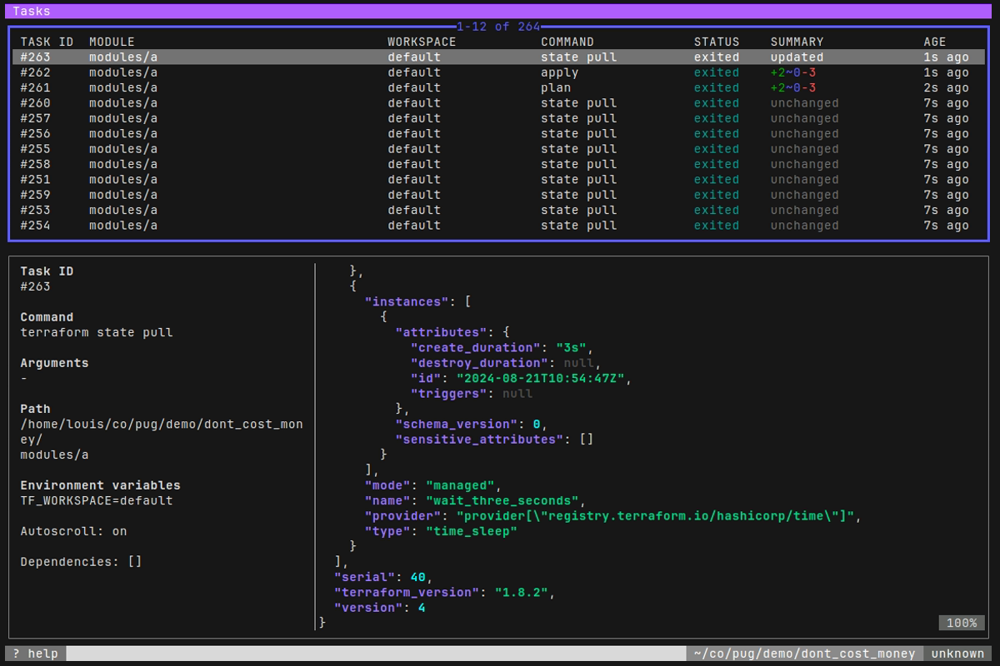

In the words of its authors [Bubbletea](https://github.com/charmbracelet/bubbletea) is a "powerful little [TUI](https://en.wikipedia.org/wiki/Text-based_user_interface) framework" for Go. It may be little but I found it had a steep learning curve before I could get truly comfortable with its power. I spent many a late night wrangling with broken layouts and unresponsive keys before learning the hard way where I had gone wrong. The result of my efforts is [PUG](https://github.com/leg100/pug), a full screen terminal interface for driving terraform:

I announced PUG on reddit and in response to a user I [provided some pointers](https://www.reddit.com/r/golang/comments/1duart8/comment/lbhwwoj/) on using Bubbletea.

This blog post is a fuller exposition of that advice; it is not a tutorial but hopefully it can assist anyone in the development, debugging, and testing of their TUI. Much of what follows is informed from various issues and discussions on the Bubbletea github project, where both users and the authors have provided invaluable expertise and guidance.

